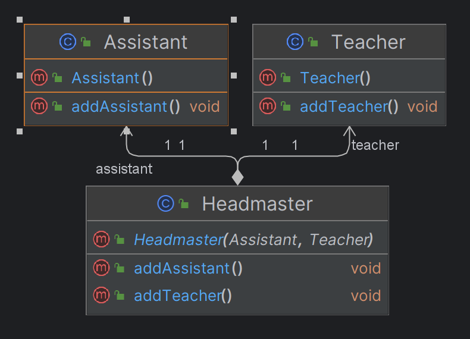
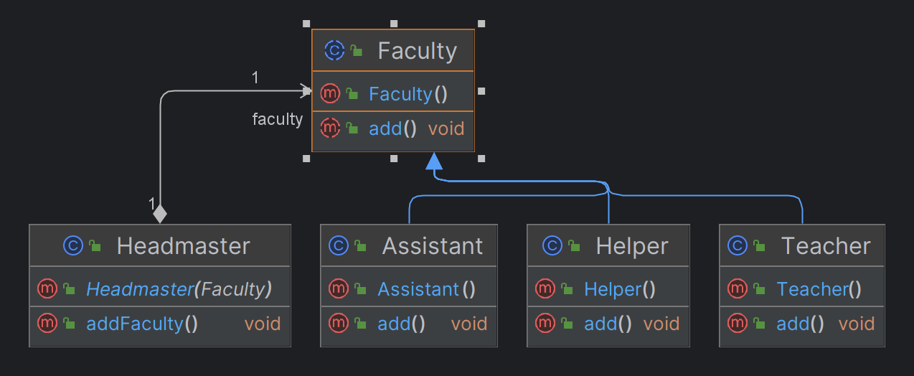

## Dependency Inversion Principle

### What is Dependency Inversion?
When we have a dependency of another module we need to depend on Interface or abstract function instead of depending on
the concrete function and classes.

Instead of injecting concrete class directly we need to maintain an abstract layer.

Example:

In the above diagram, the HeadMaster class is directly dependent on multiple types of faculty concrete classes. 
To add a new type we need to change the HeadMaster class and we need to add additional dependency in the HeadMaster class.

Using Dependency Inversion we can resolve this issue by maintaining an abstract layer. We can have an abstract class 
Faculty between concrete faculty classes and HeadMaster class. So we can abstract the implementation in abstract and 
whenever we add new Faculty we just need to Implement the abstract method in the new concurrent  classes. 
No need to change any old code.

