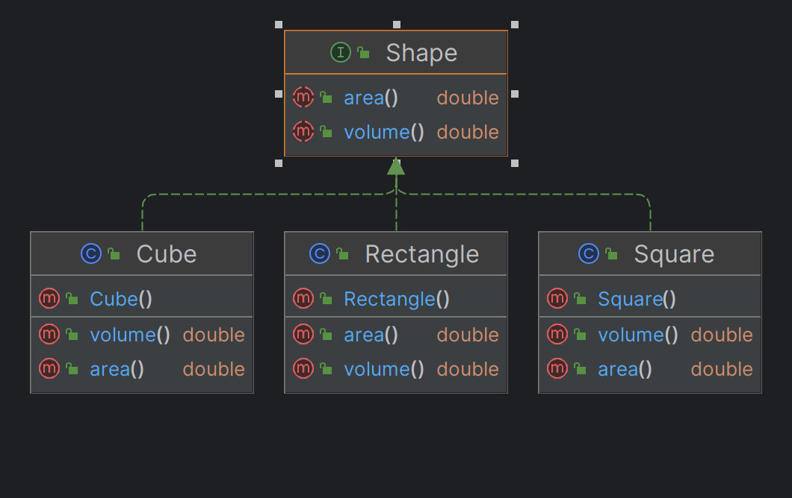
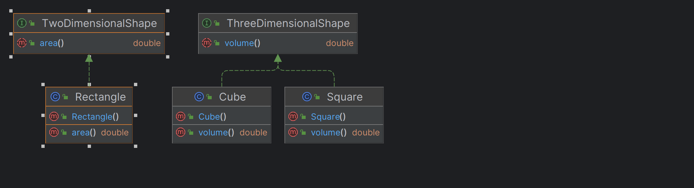

## Interface Segregation Principle

Interface segregation principle says Do not create a fat interface by combining irrelevant abstract methods in one 
Interface. If you have a fat Interface with lots of methods, divide those into small interfaces so that each one of us 
is only responsible for a specific task.

### Example:

We have a Shape Interface with two methods: **area()** and **volume()**. Which is implemented by the other subclasses 
Rectangle, Square and Cube. But Rectangle dose not have volume. But still we need to override the volume in Rectangle 
sub class. This is not a good way of creating an Interface.

To overcome this issue we can divide the Shape interface into two interfaces. One is to handle Two dimensional shapes 
and another is to handle Three dimensional shapes.
