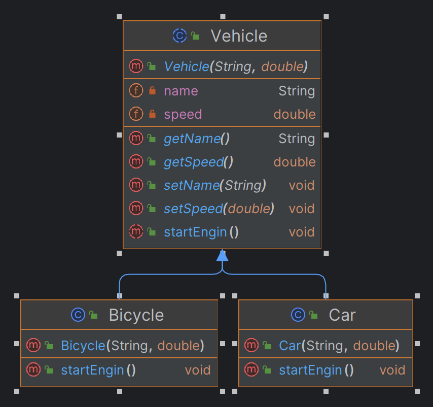
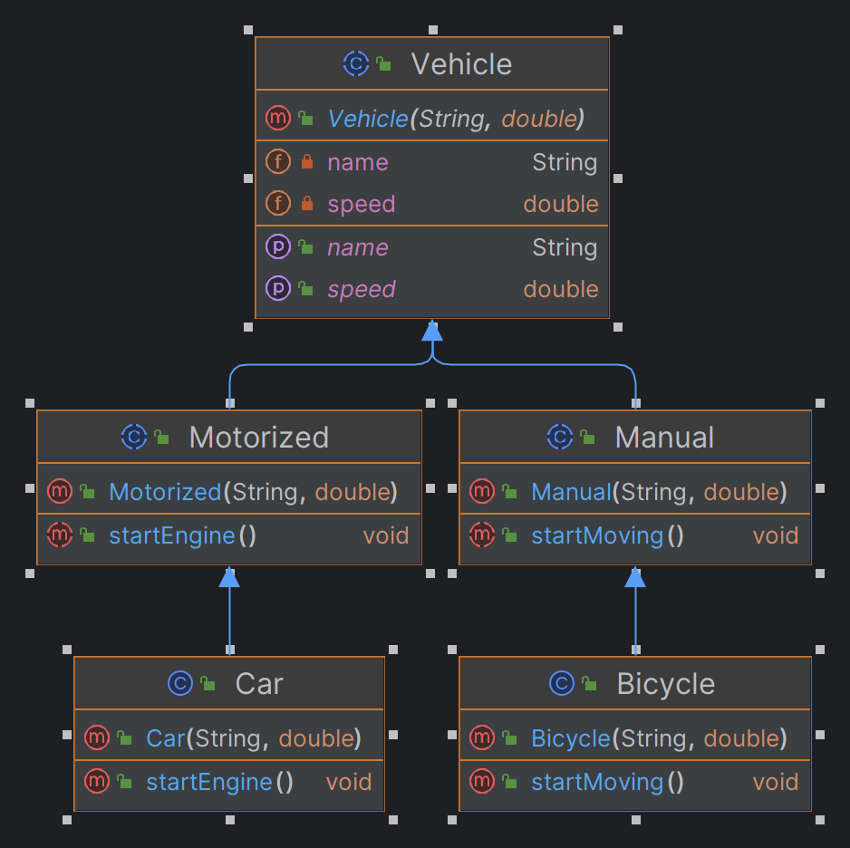

## Liskov Substitution Principle
Liskov substitution guides the usage of inheritance and abstraction in the design. It says The subclasses behave same 
as the supper class so that i can be interchangeable without breaking any functionality of the system.

### Vehicle Class

Above example the vehicle class inherited by two subclasses one is car and other one is Bicycle. In this case the 
Bicycle is not the same as the Vehicle if you replace vehicle class with Bicycle subclass the code will break. Because 
Bicycle does not have an engine.

To overcome the issue we can add an additional layer. Which have two abstract classes one is having behaviour of 
Motorized and other have the behaviours of Manual.

We can have multiple subclasses of Manual abstract class. All manual type objects are interchangeable with this 
supper class.

Same goes for Motorized class also.

